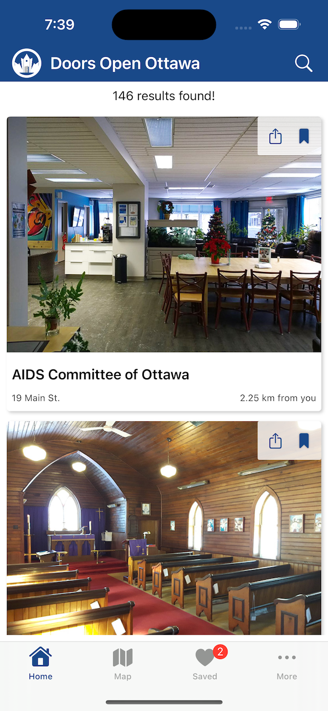
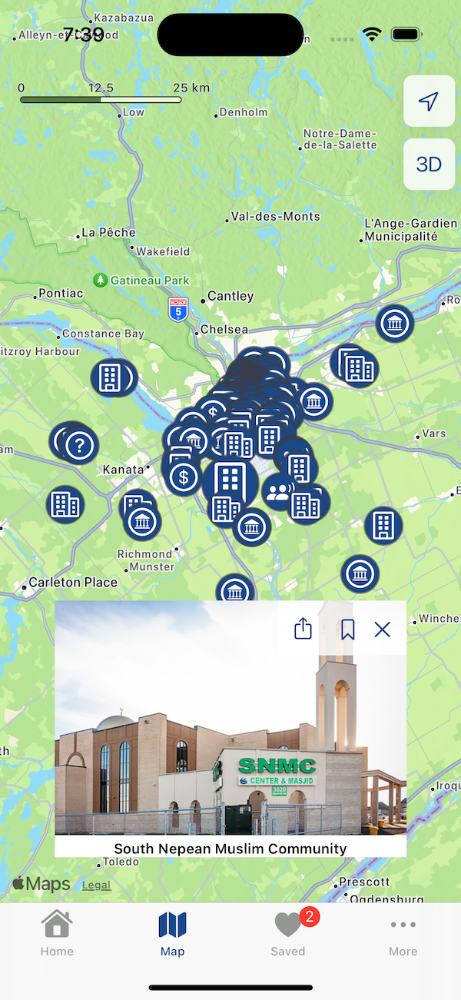
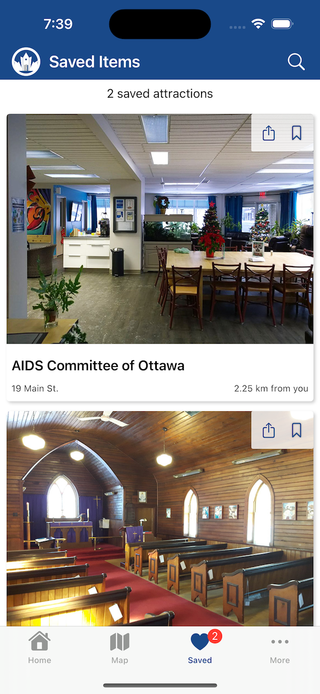
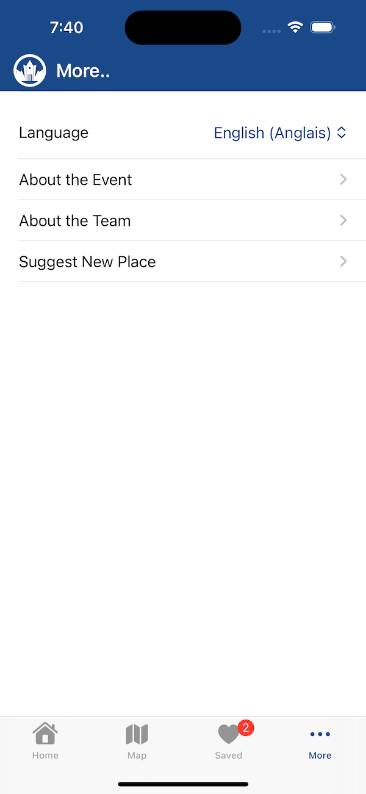
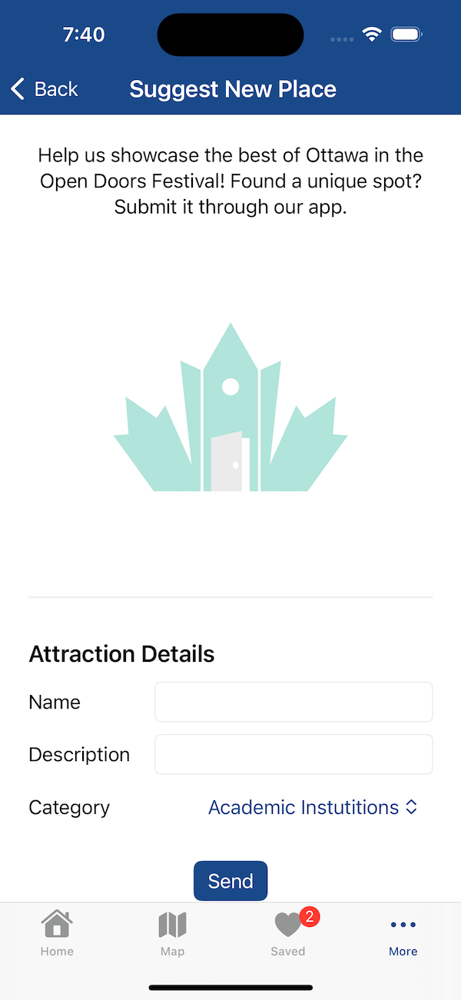
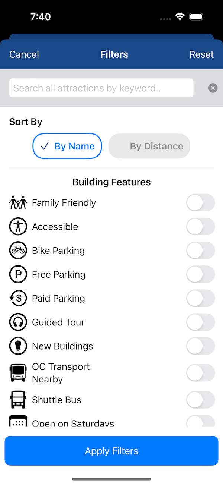

#  Doors Open Ottawa - MAD9137 Final Project

## Description
This project is a mobile app designed to showcase the Doors Open Ottawa festival for iOS users. Users can search for attractions by keyword and filter them by category. The app also displays the distance to each attraction from the user's current location.

The application leverages Observable classes for dynamic data handling.

For more information about the festival, visit:  https://www.doorsopenontario.on.ca/pages/events/ottawa

This application is the most complex iOS app I have designed as of June 2024.

## Features
- Splash screen: Initial loading screen.
- Home Screen: Displays a list of attractions, filterable by name, distance, category, and feature. Users can share and bookmark attractions.
- Map Screen: Interactive map with dynamic markers. Tapping a marker displays the attraction details in an overlay.
- Bookmark Screen: Local storage for bookmarks, with persistence across app restarts. Includes a search function to filter bookmarks.
- Dynamic Multi-lingual support. Change the app’s language without restarting.
- More Screen: Users can suggest new attractions, with submissions sent to a Firebase data collection.

##Screens

### Home Screen

---

### Map Screen

---

### Bookmarks Screen

---

### More Screen

---

### Suggest New Attraction Screen

---

### Filters Screen

---
